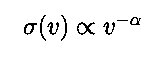
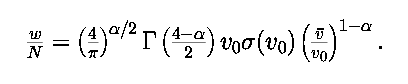

<html>
<BODY BGCOLOR="#FFFFFF" TEXT="#000070" >

<H2>How to use Anstee, Barklem & O'Mara data in spectral synthesis calculations</H2>

Here I outline how one usually goes about modifying a typical spectrum synthesis code so that you can use  Anstee, Barklem and O'Mara (ABO) cross-section data for collisional broadening by hydrogen (often called van der Waals broadening).

I aim to make available modifications for the most used freely available codes on this page.  Currently available is:
<ul>
<li> <a href="#multi">MULTI</a> (NB: minor bug fixed 25 Apr 01)
</ul>

<H3>General Outline</H3>

The calculations of ABO theory present results as broadening cross-sections (sigma), for collisions by neutral hydrogen (in atomic units or square Bohr radii) for a collision speed of 10000 m/s.  A velocity parameter (alpha), is also provided which gives the velocity dependence of the result assuming 

Anstee & O'Mara (1995) give the expression for the line width (HWHM) per unit hydrogen atom number density, which slightly modified is 

<H4>How to use in synthesis codes</H4>

Synthesis codes will require the linewidth be computed for the conditions of the current region of the atmosphere.  This is added to the radiation and Stark damping before computing the Voigt profile for use in the radiative transfer.

In our codes, we input the cross-section (at 10000 m/s) and alpha parameter directly.  We use a packed parameter INT(sigma)+alpha.  For example, for the Ca II H and K lines our input van der Waals parameter is 234.223 where sigma = 234 atomic units and alpha = 0.223 (Barklem & O'Mara 1998).  I would encourage use of this format as <a href="http://www.astro.uu.se/~vald/">VALD</a> will offer the possibility to extract data in this format in version 3.

Generally it is easy to devise a method so that parameters of different types can be mixed.  For example, if X is the input van der Waals parameter for the spectral line, the following could be used: 
<ul>
<li> X &lt; 0 is the log(FWHM) per unit perturber number density at 10000 K (rad/s cm^3) ie. log(2w/N).   This is the format used by VALD and Kurucz line lists, and many others.
<li> 0 &lt; X &lt; 20 gives an enhancement factor over classical van der Waals theory (Unsoeld 1955).
<li> X &gt; 20 gives the ABO theory as described above, sigma.alpha.
</ul> 
The advantage of our method is that the temperature dependence is easily combined, where the other methods have a fixed temperature dependence.

The fortran code below sketches how one might handle this.  The logical variable ANSTEE(LINE) has been defined true if the input GAMVW(LINE) is greater than our chosen cutoff (say 20 as above).  

<pre >
.......

C
C  NEEDED CONSTANTS
C 

      PARAMETER (PI=3.14159265)
      PARAMETER (K=1.380658E-23,M0=1.660540E-27)
      PARAMETER (A0=5.29177249E-11)

.......

C
C  van der Waals damping parameter
C
	IF (ANSTEE(LINE)) THEN
C
C  Compute the broadening by hydrogen from cross-section data 
C  Unpack the temperature dependent van der Waals parameters:
C  integer part is SIGMA and decimal part is ALPHA.
C  Also convert units to m^2
C
          SIGMA=INT(GAMVW(LINE))*A0*A0
          ALPHA=GAMVW(LINE)-INT(GAMVW(LINE))
C
C  Compute the Gamma function of X, this function is valid over the range 1&lt;X&lt;2
C  ie. 0&lt;ALPHA&lt;2 which is always satisfied
C
          X=2.-ALPHA*.5
          GX=X-1.0
          GAMMAF=1+(-.5748646+(.9512363+(-.6998588+(.4245549-.1010678*GX
     ;           )*GX)*GX)*GX)*GX
C
C  Compute the halfwidth per unit perturber number density for this temperature
C  
          GVW=(4./PI)**(ALPHA*0.5)*GAMMAF*1.E4*SIGMA
          VBAR=SQRT(8.*K*TEMPER/PI/M0*(1./1.008+1./AMASS(IELEM(LINE))))
          GVW=GVW*((VBAR/1.E4)**(1.-ALPHA))
C
C  Fullwidth given H1FRC perturbers per cm^3 with approximate He I broadening
C  The factor of 2 comes from converting to the full width.
C  The factor of 1.E6 converts from SI to cgs
C  
          GVW=GVW*(H1FRC+0.42*HE1FRC)*1.E6*2.
C
	ELSE 

..........etc

</pre>

Several variables which should be reasonably obvious:

TEMPER -> Temperature at this point in atmosphere 
AMASS(IELEM(LINE)) -> returns the atomic weight of the element producing the line, in atomic mass units (1/12 M(12Carbon)). For example Ca is 40.08. 
H1FRC -> Number density of neutral hydrogen, in particles per cubic cm 
HE1FRC ->  Number density of neutral helium, in particles per cubic cm 

<a name="multi">
<H3>Example: MULTI</H3>
</a>
Update:  minor bug fixed (ALPHA -> XALPHA) 25 April 2001 (Thanks Luc!)

As an example, here are the modifications I made to Mats Carlsson's <a href="http://www.astro.uio.no/~matsc/mul22/index.html">MULTI</a> program. 

The default for MULTI is to supply an enhancement to classical van der Waals theory (Unsoeld's theory), usually a small number between 1 and 5.  If the number is greater than 20 it is assumed to be a packed cross-section with alpha as described above, otherwise it's a van der Waals enhancement factor as previously.  

The two routines in MULTI that need to be changed are DAMP and DAMPF (found in mul22_sub.f).  You can simply substitute those below.  Note, only H-collisions are considered in this code. 

Here is the Ca II model atom, which comes with the MULTI distribution, but with my broadening calculations:

<pre>
CA 2
* ABUND   AWGT
  6.3304  40.08
*NK NLIN NCNT NFIX
  6   5   0    5
*   E         G                                ION
   0.00000   2.00000   'CA II 3P6 4S 2SE    '   2
 13650.248   4.00000   'CA II 3P6 3D 2DE 3/2'   2
 13710.900   6.00000   'CA II 3P6 3D 2DE 5/2'   2
 25191.535   2.00000   'CA II 3P6 4P 2PO 1/2'   2
 25414.465   4.00000   'CA II 3P6 4P 2PO 3/2'   2
 95785.470   1.00000   'CA III GROUND TERM  '   3
*          F       NQ  QMAX Q0 IW    GA       GVW      GS
  4  1  3.3000E-01 40  300.  3. 0  1.48E08 234.223   3.0E-06
  5  1  6.6000E-01 40  300.  3. 0  1.50E08 234.223   3.0E-06
  4  2  4.4200E-02 40   75.  .3 0  1.48E08 291.275   3.0E-06
  5  2  8.8300E-03 40   75.  .3 0  1.50E08 291.275   3.0E-06
  5  3  5.3000E-02 40   75.  .3 0  1.50E08 291.275   3.0E-06
* J  I  P    A0        TRAD ITRAD
  6  1  1  2.0363E-19  5915.  2
  6  2  1  6.1484E-18  5755.  2
  6  3  1  6.1484E-18  5755.  2
  6  4  1  2.3823E-18  4925.  2
  6  5  1  2.3823E-18  4925.  2
*  COLL
 CA2COL
 1.71E-07
 1.71E-07 4.27E-07
 2.92E-07 1.31E-06 2.08E-07
 2.92E-07 2.93E-07 1.29E-06 3.05E-07
 1.45E-10 1.88E-10 1.88E-10 2.68E-10 2.68E-10
</pre>

<spacer type="vertical" size=20>
Replace the DAMP routine in mul22_sub.f with this:
<pre>
C
C*********************************************************
C
      SUBROUTINE DAMP
C
C  CALCULATES DAMPING PARAMETERS
C  INPUT: GA, GW, GS IN  ROUTINE  ATOM WHERE
C  GAMMA = GR + GV + GS AND
C  GR=GA
C  GS=GQ*NE
C  GV=GW*GVW(H)
C
C  GVW(H) = 8.08 * (1+0.41*NHE/NH) * VH**0.6 * NH * C6**0.4
C  VH**0.6 = (8*BK*T/PI*(1/MH+1/AWGT))**0.3
C  C6 = 1.01E-32 * (13.6*ION)**2 *
C       (1/(EV(CONT)-EV(UPPER))**2 - 1/(EV(CONT)-EV(LOWER))**2)
C  REFERENCE MIHALAS 1978: STELLAR ATMOSPHERES, 2ND ED
C  NHE/NH IS SET TO 0.1
C  NB: C6 SHOULD BE DIVIDED BY 2*PI WHEN COMPARED WITH GREY AND UNSOLD
C
C
C  FOR H-ALPHA GS=4.737E-7*NH(1,K), REF. LINEAR-B
C
C:
C: DAMP   88-01-19  MODIFICATIONS: (MATS CARLSSON)
C:        IF GW=0 LEVELS WITHOUT OVERLYING CONTINUUM ARE ALLOWED
C:
C:        88-05-20  MODIFICATIONS: (MATS CARLSSON)
C:        IF GQ.LT.0 IT IS ASSUMED TO BE LG(C4)
C:
C:        93-01-18  MODIFICATIONS: (MATS CARLSSON)
C:        ADDED OPTION OF HAVING SEVERAL LINES BETWEEN TERMS
C:        FOR DOCUMENTATION OF VARIABLES, SEE ROUTINE ATOM
C:
C         00-11-27  MODIFICATIONS: (PAUL BARKLEM)
C         ABO THEORY X-SECTIONS IMPLEMENTED
C         IF GW > 20. ASSUMED X-SECTION DATA
C
      INCLUDE 'PREC'
      INCLUDE 'PARAM'
      INCLUDE 'CATOM'
      INCLUDE 'CATMOS'
      INCLUDE 'CATMO2'
      INCLUDE 'CCONST'
      INCLUDE 'CINPUT'
      INCLUDE 'CTERM'
C
      ZERO=0.
      IF(IWDAMP.GT.0) CALL WDAMP(0,0,ZERO,ZERO,ZERO,ZERO,ZERO)
C
      DO 400 K=1,NDEP
        T=TEMP(K)
        PE=NE(K)*BK*T
        TOTHI=0.0
        DO 100 J=1,5
          TOTHI=TOTHI+NH(J,K)
  100   CONTINUE
C
C  CALCULATE DOPPLER WIDTH
C
        DNYD(K)=SQRT(2.*BK*T/AWGT)*1.E-5/QNORM
C
C  INCLUDE MICROTURBULENCE
C
        DNYD(K)=SQRT(DNYD(K)**2+VTURB(K)**2)
C
C  CALCULATE GAMMA, ADAMP
C
        DO 330 KR=1,NLINE
          I=IRAD(KR)
          J=JRAD(KR) 
C
C  THIS SECTION BELOW ALTERED PB, TO USE X-SECTIONS NOV 2000
C 
          IF (GW(KR).GE.20.0) THEN
                GV=GW(KR)
                SIGMA=INT(GV)*2.80028E-21
                XALPHA=GV-INT(GV)
                GX=2.-XALPHA*.5
                GX=GX-1.0
                GAMMAF=1+(-.5748646+(.9512363+(-.6998588+
     *             (.4245549-.1010678*GX)*GX)*GX)*GX)*GX
                GV=(4./PI)**(XALPHA*0.5)*GAMMAF*1.E4*SIGMA
                VBAR=SQRT(21173.*T*(1./1.008+1./(AWGT/UU)))
                GV=GV*((VBAR/1.E4)**(1.-XALPHA))
                GV=GV*TOTHI*1.E6*2.
C
C  FIND CONTINUUM LEVEL
C
          ELSEIF(GW(KR).NE.0.0) THEN
            DO 200 IC=J+1,NK
              IF(ION(IC).EQ.ION(J)+1) GOTO 300
  200       CONTINUE
            CALL STOP(' DAMP: NO OVERLYING CONTINUUM')
  300       CONTINUE
            ZZ=ION(I)
            C625=1.283984E-12*ZZ**0.8*(1./(EV(IC)-EV(J))**2-
     *                               1./(EV(IC)-EV(I))**2)**.4
            GV=GW(KR)*8.411*(8.*BK*T/PI*(1./(1.008*UU)+1./AWGT))**0.3*
     *       TOTHI*C625
          ELSE
            GV=0.0
          ENDIF
          GR=GA(KR)
          IF(GQ(KR).GE.0.0) THEN
            GS=GQ(KR)*NE(K)
          ELSE
C           FORMULA FROM GRAY, P.237
            GSLG=19.4+2./3.*GQ(KR)+LOG10(NE(K)*BK)+LOG10(TEMP(K))/6.
            GS=10.**GSLG
          ENDIF
          IF(ATOMID.EQ.'H   ' .AND. J.EQ.3 .AND. I.EQ.2)
     *     GS=4.737E-7*NH(1,K)
          GAMMA=GR+GV+GS
          DOP=DNYD(K)*QNORM/ALAMB(KR)*1.E13
          ADAMP(K,KR)=GAMMA/(4.*PI*DOP)
          DDP=DNYD(K)*QNORM*1.E8/CC *ALAMB(KR)
          IF(IWDAMP.GT.0) CALL WDAMP(K,KR,DDP,GAMMA,GR,GV,GS)
          IF(NTERM(KR).GE.2) THEN
            DO 320 ITRM=1,NTERM(KR)
              KTRM=KTERM(ITRM,KR)
C
C   THIS SECTION BELOW ALTERED PB, TO USE X-SECTIONS NOV 2000
C
              IF(GWTERM(KTRM).GE.20.0) THEN 
                GV=GWTERM(KTRM)
                SIGMA=INT(GV)*2.80028E-21
                XALPHA=GV-INT(GV)
                GX=2.-XALPHA*.5
                GX=GX-1.0
                GAMMAF=1+(-.5748646+(.9512363+(-.6998588+
     *             (.4245549-.1010678*GX)*GX)*GX)*GX)*GX
                GV=(4./PI)**(XALPHA*0.5)*GAMMAF*1.E4*SIGMA
                VBAR=SQRT(21173.*T*(1./1.008+1./(AWGT/UU)))
                GV=GV*((VBAR/1.E4)**(1.-XALPHA))
                GV=GV*TOTHI*1.E6*2.
              ELSEIF(GWTERM(KTRM).NE.0.0) THEN
                GV=GWTERM(KTRM)*8.411*(8.*BK*T/PI*
     *           (1./(1.008*UU)+1./AWGT))**0.3*TOTHI*C625
              ELSE
                GV=0.0
              ENDIF
              GR=GATERM(KTRM)
              IF(GQTERM(KTRM).GE.0.0) THEN
                GS=GQTERM(KTRM)*NE(K)
              ELSE
C               FORMULA FROM GRAY, P.237
                GSLG=19.4+2./3.*GQTERM(KTRM)+LOG10(NE(K)*BK)+
     *           LOG10(TEMP(K))/6.
                GS=10.**GSLG
              ENDIF
              IF(ATOMID.EQ.'H   ' .AND. J.EQ.3 .AND. I.EQ.2)
     *         GS=4.737E-7*NH(1,K)
              GAMMA=GR+GV+GS
              DOP=DNYD(K)*QNORM/ALAMB(KR)*1.E13
              ADTERM(K,KTRM)=GAMMA/(4.*PI*DOP)
  320       CONTINUE
          ENDIF
  330   CONTINUE
  400 CONTINUE
      RETURN
      END
</pre>

<spacer type="vertical" size=20>
Replace the DAMPF routine in mul22_sub.f with this:
<pre>
C
C***********************************************************************
C
      SUBROUTINE DAMPF(KF)
C
C  CALCULATES DAMPING PARAMETERS FOR FIXED TRANSITIONS
C  BASED ON ROUTINE  DAMP
C:
C: DAMPF  88-05-04  NEW ROUTINE: (MATS CARLSSON)
C:        CALCULATES DAMPING PARAMETERS FOR FIXED B-B TRANSITIONS
C:        (ITRAD=4)
C:
C         00-11-27  MODIFICATIONS: (PAUL BARKLEM)
C         ABO THEORY X-SECTIONS IMPLEMENTED
C         IF GW > 20. ASSUMED X-SECTION DATA
C
      INCLUDE 'PREC'
      INCLUDE 'PARAM'
      INCLUDE 'CATOM'
      INCLUDE 'CATMOS'
      INCLUDE 'CATMO2'
      INCLUDE 'CCONST'
      INCLUDE 'CINPUT'
      INCLUDE 'CFIX'
C
      SAVE ICALL
      DATA ICALL/0/
C
      ICALL=ICALL+1
      I=IFX(KF)
      J=JFX(KF)
      WAVE=HCE/(EV(J)-EV(I))
C
      IF(GWF(KF).NE.0.0) THEN
C
C  FIND CONTINUUM LEVEL
C
        DO 200 IC=J+1,NK
          IF(ION(IC).EQ.ION(J)+1) GOTO 300
  200   CONTINUE
        CALL STOP(' DAMPF: NO OVERLYING CONTINUUM')
  300   CONTINUE
        ZZ=ION(I)
        C625=1.283984E-12*ZZ**0.8*(1./(EV(IC)-EV(J))**2-
     *                             1./(EV(IC)-EV(I))**2)**.4
      ENDIF
      GR=GAF(KF)
      DO 400 K=1,NDEP
        T=TEMP(K)
        PE=NE(K)*BK*T
        TOTHI=0.0
        DO 100 J=1,5
          TOTHI=TOTHI+NH(J,K)
  100   CONTINUE
        IF(ICALL.EQ.1) THEN
C
C  CALCULATE DOPPLER WIDTH
C
          DNYD(K)=SQRT(2.*BK*T/AWGT)*1.E-5/QNORM
C
C  INCLUDE MICROTURBULENCE
C
          DNYD(K)=SQRT(DNYD(K)**2+VTURB(K)**2)
        ENDIF
C
C  CALCULATE GAMMA, ADAMP
C
C   THIS SECTION BELOW ALTERED PB, TO USE X-SECTIONS NOV 2000
C
        IF(GWF(KF).GE.20.0) THEN 
           GV=GWF(KF)
           SIGMA=INT(GV)*2.80028E-21
           XALPHA=GV-INT(GV)
           GX=2.-XALPHA*.5
           GX=GX-1.0
           GAMMAF=1+(-.5748646+(.9512363+(-.6998588+
     *         (.4245549-.1010678*GX)*GX)*GX)*GX)*GX
           GV=(4./PI)**(XALPHA*0.5)*GAMMAF*1.E4*SIGMA
           VBAR=SQRT(21173.*T*(1./1.008+1./(AWGT/UU)))
           GV=GV*((VBAR/1.E4)**(1.-XALPHA))
           GV=GV*TOTHI*1.E6*2.
        ELSEIF(GWF(KF).NE.0.0) THEN
          GV=GWF(KF)*8.411*(8.*BK*T/PI*(1./(1.008*UU)+1./AWGT))**0.3*
     *     TOTHI*C625
        ELSE
          GV=0.0
        ENDIF
        GS=GQF(KF)*NE(K)
        IF(ATOMID.EQ.'H   ' .AND. J.EQ.3 .AND. I.EQ.2)
     *   GS=4.737E-7*NH(1,K)
        GAMMA=GR+GV+GS
        DOP=DNYD(K)*QNORM/WAVE*1.E13
        ADAMPF(K,KF)=GAMMA/(4.*PI*DOP)
  400 CONTINUE
      RETURN     
      END
</pre>

<H3>Bugs/Errors/Problems</H3>

Please report any bugs, errors or problems in what I have written above to me by email.

</body>
</html>
